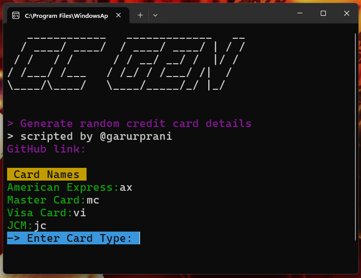

<body>
    <h1>Credit Card API Script</h1>
    <h2>Description</h2>
    
This Python script, <strong>creditcard_api.py</strong>, utilizes the LambdaTest API to generate random credit card details. It allows users to specify the type of credit card they want to generate (American Express, MasterCard, Visa, JCB) and retrieves card details including type, name, number, CVV, and expiry date.

   <h2>Screenshots</h2>
    <table>
        <tr>
            <td>
                
            </td>
        </tr>
       </table>

 <table>
      <tr>
            <td>
                
            </td>
        </tr>
       </table>

   <h2>Features</h2>
    <ul>
        <li>Generates random credit card details for different card types.</li>
        <li>Uses Colorama for colorized terminal output.</li>
        <li>Displays an ASCII art title using PyFiglet.</li>
    </ul>

   <h2>API Used</h2>
    
The script utilizes the <a href="https://backend.lambdatest.com/api/dev-tools/credit-card-generator" target="_blank">LambdaTest Credit Card Generator API</a> to fetch credit card details based on user input.

  <h2>Usage</h2>
    
Before running the script, ensure you have the necessary Python packages installed:

    <pre><code>pip install requests colorama pyfiglet</code></pre>
    
To run the script:

    <pre><code>python creditcard_api.py</code></pre>
<h2>How It Works</h2>

The <strong>Credit Card API Script</strong> interacts with the LambdaTest API to dynamically generate credit card details based on user input. Here's a breakdown of its functioning:

<ol>
    <li><strong>User Input:</strong> Users specify the type of credit card they want to generate (American Express, MasterCard, Visa, JCB) by entering the corresponding code.</li>
    <li><strong>API Interaction:</strong> The script constructs a URL with the selected card type and makes a GET request to the LambdaTest Credit Card Generator API.</li>
    <li><strong>Response Handling:</strong> Upon receiving a successful response (HTTP status code 200), the script parses the JSON data containing randomly generated credit card details.</li>
    <li><strong>Data Display:</strong> It then formats and displays the retrieved card details including type, name, number, CVV, and expiry date in a colorized terminal output.</li>
</ol>

This tool leverages Python libraries such as <code>requests</code> for API communication, <code>colorama</code> for terminal colors, and <code>pyfiglet</code> for ASCII art rendering.

   <h2>Contributing</h2>
    
Contributions are welcome! If you find any issues or have suggestions for improvements, please create an issue or submit a pull request.

   <h2>License</h2>
    
This project is licensed under the MIT License - see the <a href="LICENSE" target="_blank">LICENSE</a> file for details.

  <h2>Author @garurprani</h2>

  <h2>GitHub Repository</h2>
    
Find more details and the latest updates on <a href="https://github.com/your_username/your_repository" target="_blank">GitHub</a>.

</body>
</html>
